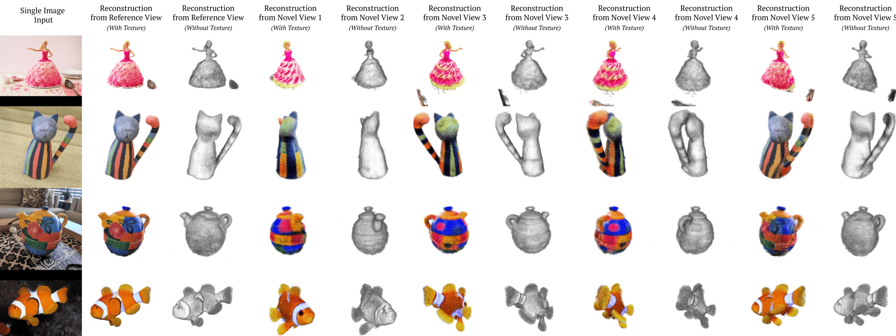

<div align="center">    

## RealFusion: 360° Reconstruction of Any Object from a Single Image
### CVPR 2023

[](https://arxiv.org/abs/2302.10663)
[](https://arxiv.org/abs/2302.10663)
</div>

<!-- TODO: Make a row-wise GIF w/ rotating examples -->

## Table of Contents

- [Table of Contents](#table-of-contents)
- [Overview](#overview)
  * [Code Overview](#code-overview)
  * [Abstract](#abstract)
  * [Examples](#examples)
  * [Method](#method)
  * [A Quick Note](#a-quick-note)
- [Running the code](#running-the-code)
  * [Dependencies](#dependencies)
  * [Data](#data)
  * [Textual Inversion](#textual-inversion)
  * [Side note: Textual Inversion Initialization](#side-note--textual-inversion-initialization)
  * [Reconstruction](#reconstruction)
  * [Examples](#examples-1)
  * [Extra tips](#extra-tips)
  * [Pretrained checkpoints](#pretrained-checkpoints)
- [Further Improvements](#further-improvements)
- [Tips for Researchers](#tips-for-researchers)
- [Contribution](#contribution)
- [Acknowledgement](#acknowledgement)
- [Citation](#citation)


## Overview

### Code Overview

This repository is based on the wonderful [stable-dreamfusion](https://github.com/ashawkey/stable-dreamfusion) repo from [ashawkey](https://github.com/ashawkey) and the [diffusers](https://github.com/huggingface/diffusers) library from HuggingFace. 

I substantially refactored the repository for the public release, so some parts of it are different from the original code used for the paper. These new changes should be improvements rather than degradations. If anything is broken due to the refactor, let me know and I will fix it.

If you have any questions or contributions, feel free to leave an issue or a pull request. 

### Abstract
We consider the problem of reconstructing a full 360° photographic model of an object from a single image of it. We do so by fitting a neural radiance field to the image, but find this problem to be severely ill-posed. We thus take an off-the-self conditional image generator based on diffusion and engineer a prompt that encourages it to "dream up" novel views of the object. Using an approach inspired by DreamFields and DreamFusion, we fuse the given input view, the conditional prior, and other regularizers in a final, consistent reconstruction. We demonstrate state-of-the-art reconstruction results on benchmark images when compared to prior methods for monocular 3D reconstruction of objects. Qualitatively, our reconstructions provide a faithful match of the input view and a plausible extrapolation of its appearance and 3D shape, including to the side of the object not visible in the image.

### Examples



### Method


### A Quick Note

The method works well on some scenes and it does not work well on others. You cannot expect it to work well on every image, especially without tuning the hyperparameters (of which there are many). The failure modes are described and shown in the paper (Figure 11). Some scenes simply do not yield solid objects, while some have strange geometries. The Janus problem (i.e. multiple faces) is common when dealing with images that contain faces. We are working on future versions of the method to improve its robustness, and this repository will be updated as we find and implement these improvements!

## Running the code

### Dependencies

Dependencies may be installed with pip:
```bash

# We try to keep requirements light
pip install -r requirements.txt

# (Recommended) Build cuda extensions -- alternatively, they can be built on-the-fly
pip install ./raymarching
pip install ./shencoder
pip install ./freqencoder
pip install ./gridencoder

# (Optional) Install nvdiffrast for exporting textured mesh (if use --save_mesh)
pip install git+https://github.com/NVlabs/nvdiffrast/
```

PyTorch and torchvision are not included in `requirements.txt` because that sometimes messes up `conda` installations by trying to re-install PyTorch using `pip`. I assume you've already installed these by yourself.

### Data

The method takes as input a square image and an object mask. These are compactly represented as an RGBA image. 

If you have an image without a mask and you would like to extract the salient object, you can use the provided helper script:
```bash
python scripts/extract-mask.py --image_path ${IMAGE_PATH} --output_dir ${OUTPUT_DIR}
```
You can also use the script to easily combine an existing image and mask into an RGBA image:
```bash
python scripts/extract-mask.py --image_path ${IMAGE_PATH} --mask_path ${MASK_PATH} --output_dir ${OUTPUT_DIR}
```

There are examples in the examples folder:
```
examples
└── natural-images
    ├── banana_1
    │   |── (there are other files here but they are not necessary)
    │   |── learned_embeds.bin (from textual inversion; explained below)
    │   └── rgba.png
    └── cactus_1
        └── rgba.png
```

### Textual Inversion

The first step of our method is running single-image textual inversion to obtain an embedding _\<e\>_ which represents your object. 

For this, you can use our code in the `textual-inversion` subdirectory. This is based on the code in diffusers [here](https://github.com/huggingface/diffusers/tree/main/examples/textual_inversion), except that it also adds heavy data augmentation. I'm planning on upstreaming this change to the diffusers library in the near future, so this script won't be necessary for much longer.

For example:
```bash
# Run this from within the textual-inversion directory

export MODEL_NAME="runwayml/stable-diffusion-v1-5"
export DATA_DIR="path-to-dir-containing-your-image"
export OUTPUT_DIR="path-to-desired-output-dir"

python textual_inversion.py \
  --pretrained_model_name_or_path=$MODEL_NAME \
  --train_data_dir=$DATA_DIR \
  --learnable_property="object" \
  --placeholder_token="_cat_statue_" \
  --initializer_token="cat" \
  --resolution=512 \
  --train_batch_size=1 \
  --gradient_accumulation_steps=4 \
  --max_train_steps=3000 \
  --learning_rate=5.0e-04 --scale_lr \
  --lr_scheduler="constant" \
  --lr_warmup_steps=0 \
  --output_dir=$OUTPUT_DIR \
  --use_augmentations
```

The script will save a model checkpoint and a `learned_embeds.bin` file to your output directory. For the next step (reconstruction), you can either use the model checkpoint directly or you can use the `learned_embeds.bin` with your original `$MODEL_NAME`. 

Note that `learned_embeds.bin` is a file containing a dictionary with the learned embedding. For example, the file looks like this when printed in a terminal:
```python
>>> import torch
>>> x = torch.load("learned_embeds.bin")
>>> print(type(x))
<class 'dict'>
>>> print(x)
{'_my_placeholder_token_': <tensor of size [512] or [768] depending on your stable diffusion model>
```

The only annoying thing about this textual inversion procedure is that it is slow. A full training run takes around 1 hour on a V100 GPU. In the future, I would like to replace it with something like [ELITE](https://arxiv.org/abs/2302.13848v1) or [encoder-based tuning](https://tuning-encoder.github.io/) which should reduce the time this steps takes down to seconds. 

### Side note: Textual Inversion Initialization 

Regarding initialization, if you would like to use CLIP to automatically find a good initializer token for textual inversion, you can use our provided script. For this you'll need to install python-fire and nltk with `pip install fire nltk`. Then you can run:
```bash
# Run this from within the textual-inversion directory

# First, compute and save embeddings for all noun tokens in the CLIP tokenizer vocabulary. This only has
# to be done once and it should take about 2 minutes on a V100 GPU. It saves a file (around 30MB) with 
# the embeddings, which is loaded when you call get_initialization.
python autoinit.py save_embeddings

# This will print the top 5 tokens to the terminal and save the top token to a file 
# named token_autoinit.txt in the same directory as your image.
python autoinit.py get_initialization /path/to/your/image.jpg
```

In most cases it is easy to come up with an initialization token yourself, but we include this script because it makes the process fully-automatic.

### Reconstruction

_TL;DR: You can run it with `python main.py --O`_

Here we optimize our NeRF to match the provided image using a combination of a standard reconstruction objective and a score distillation sampling objective. 

There are a large number of arguments that can be tuned for your specific image. These options are contained in `nerf/options.py`. The most important options are those related to (1) the camera pose for the input image, (2) the losses, and (3) the gpu/cuda acceleration. 

For the camera pose, the first key parameter is the pose angle:
```python
pose_angle: float = 75  # camera angle below the vertical
```
This corresponds to the angle _down from the vertical_. For example, see the following diagram.

<div align="center">

</div>

The default value is 80 degrees, which corresponds to 10 degrees above the horizontal plane. If your object is viewed from a more "vertical" angle, you should change this. If your image is viewed from straight-on, you can make it 90. If your image is viewed from below (which is quite unusual), then you can make it negative.

The second key parameters are the camera radii, which control how far the cameras are from the origin. 
```python
radius_range: tuple[float, float] = [1.0, 1.5]  # training camera radius range
radius_rot: Optional[float] = 1.8  # None  # circle radius for vis
```
It usually works well to set  recommended to set `radius_rot` to be a little bigger than the maximum of `radius_range`. If your object is small/large in your input image, then it might make sense to make `radius_rot` bigger/smaller.

Apart from this, there are some training options you might want to tweak. Notable options include:
```python
iters: int = 5000  # training iters
albedo_iters: int = 1000  # training iters that only use albedo shading
HW_synthetic: int = 96  # render size for synthetic images
grid_levels_mask: int = 8  # the number of levels in the feature grid to mask (to disable use 0)
grid_levels_mask_iters: int = 3_000  # the number of iterations for feature grid masking (to disable use 1_000_000)
optim: Literal['adan', 'adam', 'adamw'] = 'adamw'  # optimizer
```

For the losses, we have:
```python

# An AnnealedValue is a helper type for a value that may be annealed over the course of 
# training. It can either be a single value fixed for all of training, or a list of 
# [start_value, end_value] which is annealed linearly over all training iterations, or a 
# list of [start_value, end_value, end_iters, fn_name] which reaches its end_value at 
# end_iters and may use either linear or log annealing.
AnnealedValue = list[float]

lambda_prior: AnnealedValue = [1.0]  # loss scale for diffusion model
lambda_image: AnnealedValue = [5.0]  # loss scale for real image
lambda_mask: AnnealedValue = [0.5]  # loss scale for real mask
lambda_entropy: AnnealedValue = [1e-4]  # loss scale for alpha entropy
lambda_opacity: AnnealedValue = [0]  # loss scale for alpha value
lambda_orient: AnnealedValue = [1e-2]  # loss scale for orientation
lambda_smooth: AnnealedValue = [0]  # loss scale for surface smoothness
lambda_smooth_2d: AnnealedValue = [0.5]  # loss scale for surface smoothness (2d version)
```

For CUDA acceleration, there are options including `--fp16` and `--cuda_ray`. It is recommended to use `--O`, which sets multiple of these options automatically. 
```python
fp16: bool = False  # use fp16
cuda_ray: bool = True  # use CUDA raymarching instead of pytorch
```
During development and testing, I always used `--O`. Currently, I have not implemented raymarching without `--O`. If you need this feature, leave an issue and I can try to address it.

Now that you have a sense of the parameters, here are some example commands.

### Examples

```bash
export TOKEN="_cake_2_"  # set this according to your textual inversion placeholder_token or use the trick below
export DATA_DIR=$PWD/examples/natural-images/cake_2

python main.py --O \
    --image_path $DATA_DIR/rgba.png \
    --learned_embeds_path $DATA_DIR/learned_embeds.bin \
    --text "A high-resolution DSLR image of a $TOKEN" \
    --pretrained_model_name_or_path "runwayml/stable-diffusion-v1-5"
```

```bash
export TOKEN="_cat_statue_"  # set this according to your textual inversion placeholder_token
export DATA_DIR=$PWD/examples/natural-images/cat_statue

python main.py --O \
    --image_path $DATA_DIR/rgba.png \
    --learned_embeds_path $DATA_DIR/learned_embeds.bin \
    --text "A high-resolution DSLR image of a $TOKEN" \
    --pretrained_model_name_or_path "runwayml/stable-diffusion-v1-5"
```

```bash
export TOKEN="_colorful_teapot_"  # set this according to your textual inversion placeholder_token
export DATA_DIR=$PWD/examples/natural-images/cake_2

python main.py --O \
    --image_path $DATA_DIR/rgba.png \
    --learned_embeds_path $DATA_DIR/learned_embeds.bin \
    --text "A high-resolution DSLR image of a $TOKEN" \
    --pretrained_model_name_or_path "runwayml/stable-diffusion-v1-5"
```

### Extra tips

If you are using `--learned_embeds_path`, then you can use `<token>` in your prompt and this will automatically be replaced by your learned token. For example:
```bash
export DATA_DIR=$PWD/examples/natural-images/cake_2

python main.py --O \
    --image_path $DATA_DIR/rgba.png \
    --learned_embeds_path $DATA_DIR/learned_embeds.bin \
    --text "A high-resolution DSLR image of a <token>"
```

To run multiple jobs in parallel on a SLURM cluster, you can use a script such as:
```bash
python scripts/example-slurm.py
```

### Pretrained checkpoints

You can download our full checkpoints and logs for the example images using
```bash
bash ./scripts/download-example-logs-and-checkpoints.sh
```
Note that these are all run with the same parameters (the default parameters). To be precise, they are produced by simply running the example slurm script above. Some are better than others, and they can absolutely be improved if you (1) tweak parameters on a per-example basis, and (2) running multiple random seeds and choosing one of the better generations. You can see examples of a common failure case (two-headed generations; the Janus problem) in the `teddy_bear_1` example.

## Further Improvements

I indend to continue supporting and improving this respository while working toward a second version of the method. Further improvements include
 - [ ] Normals predicted with an MLP as in Magic3D
 - [ ] Use a feedforward inversion method (e.g. [ELITE](https://arxiv.org/abs/2302.13848v1) or [encoder-based tuning](https://tuning-encoder.github.io/)) or possibly even an unCLIP-style model (example).
 - [ ] Add vanilla network for people without cuda-enabled gpus
 - [ ] Create a colab

## Tips for Researchers

_I have some tips in mind. I'll add them as soon as I get time._

## Contribution

Pull requests are welcome!

## Acknowledgement

* The wonderful work by ashawkey:
    ```
    @misc{stable-dreamfusion,
        Author = {Jiaxiang Tang},
        Year = {2022},
        Note = {https://github.com/ashawkey/stable-dreamfusion},
        Title = {Stable-dreamfusion: Text-to-3D with Stable-diffusion}
    }
    ```

* The original DreamFusion paper: [_DreamFusion: Text-to-3D using 2D Diffusion_](https://dreamfusion3d.github.io/).
    ```
    @article{poole2022dreamfusion,
        author = {Poole, Ben and Jain, Ajay and Barron, Jonathan T. and Mildenhall, Ben},
        title = {DreamFusion: Text-to-3D using 2D Diffusion},
        journal = {arXiv},
        year = {2022},
    }
    ```

* The [Stable Diffusion](https://github.com/CompVis/stable-diffusion) model

    ```
    @misc{rombach2021highresolution,
        title={High-Resolution Image Synthesis with Latent Diffusion Models}, 
        author={Robin Rombach and Andreas Blattmann and Dominik Lorenz and Patrick Esser and Björn Ommer},
        year={2021},
        eprint={2112.10752},
        archivePrefix={arXiv},
        primaryClass={cs.CV}
    }
    ```

* The [diffusers](https://github.com/huggingface/diffusers) library. 
    ```
    @misc{von-platen-etal-2022-diffusers,
        author = {Patrick von Platen and Suraj Patil and Anton Lozhkov and Pedro Cuenca and Nathan Lambert and Kashif Rasul and Mishig Davaadorj and Thomas Wolf},
        title = {Diffusers: State-of-the-art diffusion models},
        year = {2022},
        publisher = {GitHub},
        journal = {GitHub repository},
        howpublished = {\url{https://github.com/huggingface/diffusers}}
    }
    ```

* Our funding: Luke Melas-Kyriazi is supported by the Rhodes Trust. Andrea Vedaldi, Iro Liana and Christian Rupprecht are supported by ERC-UNION-CoG-101001212. Christian Rupprecht is also supported by VisualAI EP/T028572/1.

## Citation

```
@inproceedings{melaskyriazi2023realfusion,
  author = {Melas-Kyriazi, Luke and Rupprecht, Christian and Laina, Iro and Vedaldi, Andrea},
  title = {RealFusion: 360 Reconstruction of Any Object from a Single Image},
  booktitle={CVPR}
  year = {2023},
  url = {https://arxiv.org/abs/2302.10663},
}
```
