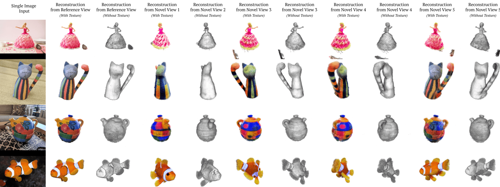

<div align="center">    

## RealFusion: 360° Reconstruction of Any Object from a Single Image

[](https://arxiv.org/abs/2302.10663)
<!-- [](https://papers.nips.cc/book/advances-in-neural-information-processing-systems-31-2018)   -->
</div>
 
### Code will be available soon! 

The code will be released by Wednesday, March 1.

### Abstract
We consider the problem of reconstructing a full 360° photographic model of an object from a single image of it. We do so by fitting a neural radiance field to the image, but find this problem to be severely ill-posed. We thus take an off-the-self conditional image generator based on diffusion and engineer a prompt that encourages it to "dream up" novel views of the object. Using an approach inspired by DreamFields and DreamFusion, we fuse the given input view, the conditional prior, and other regularizers in a final, consistent reconstruction. We demonstrate state-of-the-art reconstruction results on benchmark images when compared to prior methods for monocular 3D reconstruction of objects. Qualitatively, our reconstructions provide a faithful match of the input view and a plausible extrapolation of its appearance and 3D shape, including to the side of the object not visible in the image.


### Examples



### Method


#### Dependencies
*Coming soon*

 <!-- - PyTorch (tested on version 1.7.1, but should work on any version)
 - Hydra: `pip install hydra-core --pre`
 - Other:
 ```
 pip install albumentations tqdm tensorboard accelerate timm 
 ```
 - Optional: 
 ```
 pip install timm wandb
 pip install git+https://github.com/fadel/pytorch_ema
 ``` -->

#### Training
*Coming soon*

<!-- ```bash
python main.py 
```-->

#### Inference / Visualization
*Coming soon*

<!-- ```bash
python main.py job_type="eval"
``` -->

#### Acknowledgements

Luke Melas-Kyriazi is supported by the Rhodes Trust. Andrea Vedaldi, Iro Liana and Christian Rupprecht are supported by ERC-UNION-CoG-101001212. Christian Rupprecht is also supported by VisualAI EP/T028572/1.

#### Citation   
```
@misc{melaskyriazi2023realfusion,
  doi = {10.48550/ARXIV.2302.10663},
  url = {https://arxiv.org/abs/2302.10663},
  author = {Melas-Kyriazi, Luke and Rupprecht, Christian and Laina, Iro and Vedaldi, Andrea},
  title = {RealFusion: 360° Reconstruction of Any Object from a Single Image},
  publisher = {arXiv},
  year = {2023},
}
``` -->